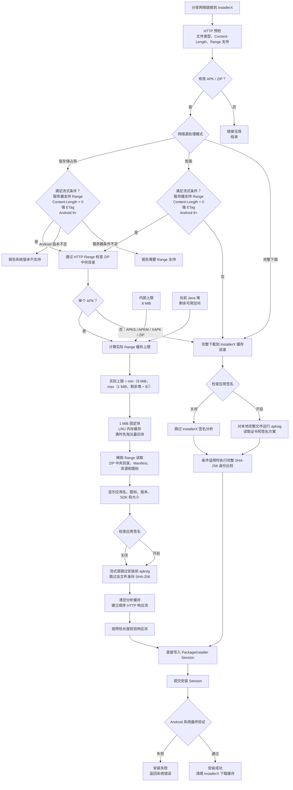

# InstallerX Revived (Community Edition)

[English](README.md) | **简体中文** | [Español](README_ES.md) | [日本語](README_JA.md) | [Deutsch](README_DE.md)

[](https://www.gnu.org/licenses/gpl-3.0)
[](https://github.com/wxxsfxyzm/InstallerX/releases/latest)
[](https://github.com/wxxsfxyzm/InstallerX/releases)
[](https://t.me/installerx_revived)

> A modern and functional Android app installer. (You know some birds are not meant to be caged, their feathers are just too bright.)

一款应用安装程序，为什么不试试 **InstallerX**？

InstallerX Revived 是一款现代 Android 软件包安装器，也是原 [InstallerX](https://github.com/iamr0s/InstallerX) 项目的社区维护续作。

它旨在替代功能受限的原生或 OEM 安装器，提供更完整的包格式支持、更清晰的安装界面、可按来源定制的配置文件，以及基于 Shizuku、Root、Dhizuku 或系统包管理器模式的特权工作流。

## 文档

完整用户指南、安装说明、高级选项、系统集成和 FAQ 统一维护在[文档站](https://wxxsfxyzm.github.io/InstallerX-Revived-Website/zh/)。

## 核心能力

- **安装包格式：** APK、APKS、APKM、XAPK、ZIP 压缩包内 APK，以及批量 APK 安装。
- **安装流程：** 对话框安装、通知栏后台安装、自动安装、具备权限时的静默安装，以及支持系统上的 Android 16+ 实时活动进度。
- **授权方式：**
  - **Root：** 能以最高权限执行所有特权操作，但冷启动 `app_process` 时性能通常略弱。
  - **Shizuku：** 根据激活方式获得 shell 或 root 权限，通常比直接 Root 响应更快。
  - **Dhizuku：** 受 DevicePolicyManager API 限制，可完成锁定安装器、安装应用等部分操作，但面对其他特权场景能力有限。
  - **无特权：** 完全受系统限制，但 InstallerX 作为系统包管理器运行时可以获得静默安装能力。
- **配置文件：** 定义安装和卸载请求如何处理，包括安装模式、授权覆盖、安装者/请求方信息、目标用户、DexOpt、自动删除、分包选择、黑名单策略和签名门禁。
- **系统集成：** 可从首页状态卡进入默认安装器页面完成锁定，必要时配合 [InxLocker](https://github.com/Chimioo/InxLocker) 等 LSPosed 模块，也可由高级用户作为系统包管理器替换系统安装器。
- **现代界面：** Material 3 Expressive 与 Miuix 两套界面，深色模式、动态取色、高级调色板、系统图标包、多彩对话框、标准通知、实时活动，以及在支持的小米设备上以小米超级岛发送通知。
- **安全控制：** 包名和 SharedUID 黑名单、签名不匹配和未知签名策略门禁、权限预览、安装标志位，以及部分阻止场景的一次性智能建议。

## 支持版本

- **完整支持：** Android SDK 34 - 37.0
- **有限支持：** Android SDK 26 - 33

有限支持表示 InstallerX 可能可以运行，但部分功能会受到 Android 框架、OEM 系统或授权方式限制。

## 下载

- **稳定版：** https://github.com/wxxsfxyzm/InstallerX-Revived/releases/latest
- **Alpha 构建：** https://github.com/wxxsfxyzm/InstallerX/releases
- **CI 构建：** https://github.com/wxxsfxyzm/InstallerX-Revived/actions/workflows/auto-preview-dev.yml
- **Telegram 频道：** https://t.me/installerx_revived

反馈问题时请尽量使用最新 Alpha 或 CI 版本复现，因为 Stable 中的问题可能已经被修复。

InstallerX 现在只发布一个 APK，通过应用内开关控制联网。开启时支持分享 APK 下载直链和在线更新；网络流式安装要求服务器提供强 HTTP ETag，通过有界 HTTP Range 读取应用信息，跳过安装前的全文件签名扫描和字节身份哈希，将 APK 流式写入系统安装 Session，并在安装前校验最终响应长度。Android 还会在 Session 提交时完成最终完整性、签名和更新兼容性验证。关闭联网后会阻止网络请求，但本地安装流程仍可正常使用。为了兼容旧版应用内更新客户端，发布文件名仍保留 `online`，这不再代表独立的构建变体。

## 网络源处理流程

“检查应用签名”控制 InstallerX 的安装前 `apksig` 分析。Android 系统在提交安装 Session 时始终执行最终完整性、签名和更新兼容性验证。



## 构建项目

InstallerX Revived 是 Android Gradle 项目。

### 环境要求

- **JDK 25**，并正确配置 `JAVA_HOME`。
- Android SDK / Android Studio，并安装所需平台和构建工具。
- 用于下载 snapshot `miuix` 依赖的 GitHub Packages 凭据。

### GitHub Packages 认证

GitHub Packages 即使下载公开包也需要认证。请创建一个带有 `read:packages` 权限的 classic personal access token，并写入全局 Gradle 配置：

- Linux / macOS: `~/.gradle/gradle.properties`
- Windows: `%USERPROFILE%\.gradle\gradle.properties`

```properties
gpr.user=YOUR_GITHUB_USERNAME
gpr.key=YOUR_PERSONAL_ACCESS_TOKEN
```

不要把这些凭据提交到仓库中。

### 构建命令

本地 Debug 构建：

```bash
./gradlew assembleUnstableDebug
```

使用单独应用 ID 的 PR 检查构建：

```bash
./gradlew assemblePreviewDebug -PAPP_ID="com.rosan.installer.x.revived.test"
```

## 常见问题

### 应该在哪里反馈问题或提问？

可复现的 bug 和明确的 feature request 请提交到 [GitHub Issues](https://github.com/wxxsfxyzm/InstallerX-Revived/issues)，如果有好的建议也欢迎提出。一般问题和兼容性讨论可以使用 [GitHub Discussions](https://github.com/wxxsfxyzm/InstallerX-Revived/discussions) 或 [Telegram 频道](https://t.me/installerx_revived)。

提交 issue 前请先阅读 [CONTRIBUTING.md](../CONTRIBUTING.md)，并按要求提供日志和复现信息。

### 无法锁定 InstallerX 为默认安装器？

部分 OEM 系统会严格限制默认安装器。请从首页状态卡进入默认安装器页面后尝试锁定。如果 ROM 仍然阻止锁定，请配合 [InxLocker](https://github.com/Chimioo/InxLocker) 等 LSPosed 模块使用。

### HyperOS 提示安装系统应用需要有效安装者？

这是 OEM 安全限制。InstallerX 可以通过配置文件声明安装者信息，并在 HyperOS 上默认使用 `com.android.shell` 作为兼容安装者包名。该功能需要 Shizuku 或 Root，Dhizuku 不支持。

### 通知安装进度卡住？

部分 ROM 对后台服务限制很严格。如果通知安装卡住，请将 InstallerX 的后台电量策略设为无限制。InstallerX 会在安装任务结束后短时间内清理前台服务。

### 如何替换系统包管理器？

这是高风险高级操作。简要来说，可以在核心破解后覆盖安装 APK，也可以刷入匹配模块，或在打包 `super` / 制作 ROM 时内置匹配包。刷入或打包前必须确认包名、挂载路径和权限文件与当前 ROM 完全匹配。

详见系统集成文档：https://wxxsfxyzm.github.io/InstallerX-Revived-Website/zh/guide/system-integration

## 本地化

欢迎通过 [Weblate](https://hosted.weblate.org/engage/installerx-revived/) 参与翻译。

[](https://hosted.weblate.org/engage/installerx-revived/)

## 开源协议

Copyright (C) [iamr0s](https://github.com/iamr0s) and [InstallerX Revived Contributors](https://github.com/wxxsfxyzm/InstallerX-Revived/graphs/contributors)

InstallerX Revived 基于 [GNU General Public License v3](http://www.gnu.org/licenses/gpl-3.0) 开源。

如果你基于 InstallerX Revived 进行开发，需要遵循你所使用的具体源码版本对应的开源协议。

## 致谢

本项目使用了以下项目的代码，或参考了它们的实现：

- [iamr0s/InstallerX](https://github.com/iamr0s/InstallerX)
- [tiann/KernelSU](https://github.com/tiann/KernelSU)
- [RikkaApps/Shizuku](https://github.com/RikkaApps/Shizuku)
- [zacharee/InstallWithOptions](https://github.com/zacharee/InstallWithOptions)
- [vvb2060/PackageInstaller](https://github.com/vvb2060/PackageInstaller)
- [compose-miuix-ui/miuix](https://github.com/compose-miuix-ui/miuix)

## Star History

<a href="https://www.star-history.com/?repos=wxxsfxyzm%2FInstallerX-Revived&type=date&legend=top-left">
 <picture>
   <source media="(prefers-color-scheme: dark)" srcset="https://api.star-history.com/chart?repos=wxxsfxyzm/InstallerX-Revived&type=date&theme=dark&legend=top-left&sealed_token=NIZn5WH0-dVDGHKTPTVKAke10T3j7OrdIZ6rTbhT4zwN5AyJhj5aJhc36MEg2ZD5FoBrDoxgF3jzozO8cpBCQoJ65WbUGZZestdrI42Rnv8QVdEvE9Jz-qfghs5RpT5BeRHLuDH2NLyDNypEg34_XaPsTDAkx6DZAl0bUc0tpa0C2xzKBPih_ELq-sP2" />
   <source media="(prefers-color-scheme: light)" srcset="https://api.star-history.com/chart?repos=wxxsfxyzm/InstallerX-Revived&type=date&legend=top-left&sealed_token=NIZn5WH0-dVDGHKTPTVKAke10T3j7OrdIZ6rTbhT4zwN5AyJhj5aJhc36MEg2ZD5FoBrDoxgF3jzozO8cpBCQoJ65WbUGZZestdrI42Rnv8QVdEvE9Jz-qfghs5RpT5BeRHLuDH2NLyDNypEg34_XaPsTDAkx6DZAl0bUc0tpa0C2xzKBPih_ELq-sP2" />
   
 </picture>
</a>
