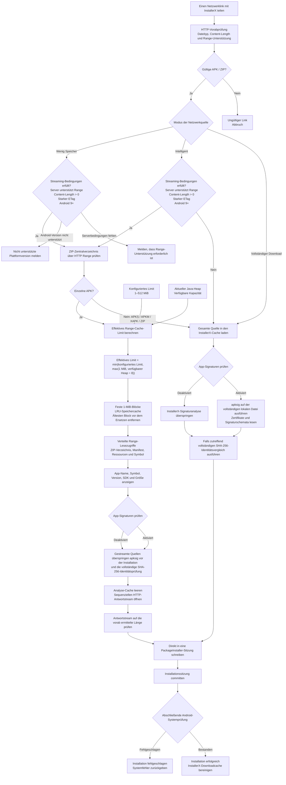

# InstallerX Revived (Community Edition)

[English](README.md) | [简体中文](README_CN.md) | [Español](README_ES.md) | [日本語](README_JA.md) | **Deutsch**

[](https://www.gnu.org/licenses/gpl-3.0)
[](https://github.com/wxxsfxyzm/InstallerX/releases/latest)
[](https://github.com/wxxsfxyzm/InstallerX/releases)
[](https://t.me/installerx_revived)

> Ein moderner und funktionaler Android-App-Installer. (Manche Vögel sind nicht dafür gemacht, eingesperrt zu werden, ihre Federn sind einfach zu hell.)

Du suchst nach einem besseren App-Installer? Probiere **InstallerX**.

InstallerX Revived ist ein moderner Android-Paketinstaller und die von der Community gepflegte Fortsetzung des ursprünglichen [InstallerX](https://github.com/iamr0s/InstallerX)-Projekts.

Er soll eingeschränkte Stock- oder OEM-Installer durch eine klarere Oberfläche, breitere Paketunterstützung, konfigurierbare Installationsprofile und privilegierte Workflows über Shizuku, Root, Dhizuku oder den Systeminstaller-Modus ersetzen.

## Dokumentation

Das vollständige Benutzerhandbuch, Installationsanweisungen, erweiterte Optionen, Hinweise zur Systemintegration und die FAQ werden auf der [Dokumentationsseite](https://wxxsfxyzm.github.io/InstallerX-Revived-Website/) gepflegt.

## Hauptfunktionen

- **Paketformate:** APK, APKS, APKM, XAPK, APKs in ZIP-Archiven und Batch-Installation von APKs.
- **Installationsabläufe:** Dialoginstallation, Hintergrundinstallation per Benachrichtigung, automatische Installation, stille Installation bei ausreichenden Rechten und Android-16+-Live-Activity-Fortschritt auf unterstützten Systemen.
- **Autorisierungsarten:**
  - **Root:** kann alle privilegierten Operationen ausführen, kann aber wegen des kalten Starts von `app_process` langsamer sein.
  - **Shizuku:** erhält je nach Aktivierungsart shell- oder rootähnliche Rechte und reagiert meist schneller als direkter Root-Zugriff.
  - **Dhizuku:** kann DevicePolicyManager-basierte Operationen wie das Fixieren des Standardinstallers und App-Installationen ausführen, ist aber bei anderen privilegierten Aufgaben eingeschränkt.
  - **None:** ist vollständig durch das System begrenzt, kann aber lautlos installieren, wenn InstallerX als Systeminstaller läuft.
- **Profile:** legen fest, wie Installations- und Deinstallationsanfragen verarbeitet werden, einschließlich Installationsmodus, Autorisierer-Override, Installer-/Requester-Metadaten, Zielbenutzer, DexOpt, automatischem Löschen, Split-Auswahl, Sperrlisten und Signaturrichtlinien.
- **Systemintegration:** InstallerX kann über die Statuskarte auf der Startseite als Standardinstaller fixiert, mit LSPosed-Modulen wie [InxLocker](https://github.com/Chimioo/InxLocker) verwendet oder von fortgeschrittenen Nutzern als Ersatz für den Systeminstaller installiert werden.
- **Moderne Oberfläche:** Material 3 Expressive und Miuix, Dunkelmodus, dynamische Farben, erweiterte Paletten, System-Icon-Packs, farbige Dialoge, Standardbenachrichtigungen, Live Activity und Xiaomi-HyperOS-ähnliche Island-Benachrichtigungen auf unterstützten Xiaomi-Geräten.
- **Sicherheitskontrollen:** Sperrlisten nach Paketname und SharedUID, Richtlinien für Signaturabweichungen und unbekannte Signaturen, Berechtigungsvorschau, Installationsflags und einmalige intelligente Vorschläge für ausgewählte Blockierungen.

## Unterstützte Android-Versionen

- **Vollständige Unterstützung:** Android SDK 34 - 37.0
- **Eingeschränkte Unterstützung:** Android SDK 26 - 33

Eingeschränkte Unterstützung bedeutet, dass InstallerX funktionieren kann, einige Funktionen jedoch wegen Android-Framework-, OEM- oder Autorisierer-Einschränkungen fehlen oder anders arbeiten können.

## Downloads

- **Stabile Versionen:** https://github.com/wxxsfxyzm/InstallerX-Revived/releases/latest
- **Alpha-Builds:** https://github.com/wxxsfxyzm/InstallerX/releases
- **CI-Builds:** https://github.com/wxxsfxyzm/InstallerX-Revived/actions/workflows/auto-preview-dev.yml
- **Telegram-Kanal:** https://t.me/installerx_revived

Wenn du Fehler meldest, reproduziere sie bitte nach Möglichkeit mit dem neuesten Alpha- oder CI-Build, da Probleme aus Stable möglicherweise bereits behoben wurden.

InstallerX wird als eine einzige APK veröffentlicht, deren Netzwerkzugriff über eine Einstellung in der App gesteuert wird. Wenn er aktiviert ist, werden direkte APK-Downloadlinks und Online-Update-Funktionen unterstützt. Gestreamte Netzwerkinstallationen erfordern einen starken HTTP-ETag, verwenden begrenzte HTTP-Range-Lesezugriffe für App-Informationen, überspringen die vollständige Signatur- und Byte-Identitätsprüfung vor der Installation, streamen die APK in eine Systeminstallationssitzung und prüfen vor der Installation die Länge der endgültigen Antwort. Android führt beim Commit der Sitzung zusätzlich die abschließende Integritäts-, Signatur- und Update-Kompatibilitätsprüfung durch. Wenn der Netzwerkzugriff deaktiviert ist, werden Netzwerkanfragen blockiert, während lokale Installationsabläufe weiter funktionieren. Der Dateiname der veröffentlichten APK enthält zur Kompatibilität mit älteren In-App-Update-Clients weiterhin `online`; dies kennzeichnet keine separate Build-Variante mehr.

## Verarbeitung von Netzwerkquellen

`App-Signaturen prüfen` steuert die `apksig`-Analyse von InstallerX vor der Installation. Android führt beim Commit der Installationssitzung immer die abschließende Integritäts-, Signatur- und Update-Kompatibilitätsprüfung durch.



## Build

InstallerX Revived ist ein Android-Gradle-Projekt.

### Voraussetzungen

- **JDK 25** mit korrekt gesetztem `JAVA_HOME`.
- Android SDK / Android Studio mit den benötigten Plattformen und Build-Tools.
- GitHub-Packages-Zugangsdaten für die Snapshot-Abhängigkeit `miuix`.

### GitHub-Packages-Authentifizierung

GitHub Packages erfordert auch für öffentliche Pakete eine Authentifizierung. Füge deinen GitHub-Benutzernamen und ein klassisches personal access token mit dem Scope `read:packages` in deine globale Gradle-Properties-Datei ein:

- Linux / macOS: `~/.gradle/gradle.properties`
- Windows: `%USERPROFILE%\.gradle\gradle.properties`

```properties
gpr.user=YOUR_GITHUB_USERNAME
gpr.key=YOUR_PERSONAL_ACCESS_TOKEN
```

Committe diese Zugangsdaten nicht in dieses Repository.

### Build-Befehle

Lokaler Debug-Build:

```bash
./gradlew assembleUnstableDebug
```

PR-Testbuild mit separater App-ID:

```bash
./gradlew assemblePreviewDebug -PAPP_ID="com.rosan.installer.x.revived.test"
```

## Häufige Fragen

### Wo melde ich Fehler oder stelle Fragen?

Nutze [GitHub Issues](https://github.com/wxxsfxyzm/InstallerX-Revived/issues) für reproduzierbare Bugs und konkrete Feature Requests. Gute Vorschläge sind ebenfalls willkommen. Nutze [GitHub Discussions](https://github.com/wxxsfxyzm/InstallerX-Revived/discussions) oder den [Telegram-Kanal](https://t.me/installerx_revived) für allgemeine Fragen und Kompatibilitätsdiskussionen.

Lies vor dem Öffnen eines Issues [CONTRIBUTING.md](../CONTRIBUTING.md), um die erforderlichen Logs und Reproduktionsdetails bereitzustellen.

### InstallerX lässt sich nicht als Standardinstaller fixieren

Einige OEM-Systeme kontrollieren den Standard-Paketinstaller sehr streng. Öffne die Seite des Standardinstallers über die Statuskarte auf der Startseite und versuche es dort. Wenn die ROM es weiterhin verhindert, nutze ein LSPosed-Modul wie [InxLocker](https://github.com/Chimioo/InxLocker).

### HyperOS meldet, dass System-App-Installationen einen gültigen Installer benötigen

Das ist eine OEM-Sicherheitsbeschränkung. InstallerX kann Installer-Metadaten über Profile deklarieren und verwendet unter HyperOS `com.android.shell` als Standard-Kompatibilitätsinstallerpaket. Dieser Workflow erfordert Shizuku oder Root; Dhizuku reicht nicht aus.

### Der Fortschritt der Benachrichtigungsinstallation bleibt hängen

Einige ROMs beschränken Hintergrunddienste sehr aggressiv. Setze InstallerX auf uneingeschränkte Hintergrund-/Akkunutzung, wenn die Benachrichtigungsinstallation hängen bleibt. InstallerX räumt seinen Vordergrunddienst kurz nach Abschluss der Installation auf.

### Wie ersetze ich den Systeminstaller?

Das ist ein risikoreicher Workflow für fortgeschrittene Nutzer. Kurz gesagt: Verwende Core Patch, um das APK zu überschreiben, flashe ein passendes Modul oder integriere das passende Paket in `super` / einen ROM-Build. Prüfe vor dem Flashen oder Packen Paketnamen, Mount-Pfad und Berechtigungsdatei deiner ROM.

Siehe die Anleitung zur Systemintegration: https://wxxsfxyzm.github.io/InstallerX-Revived-Website/guide/system-integration

## Lokalisierung

Hilf mit, InstallerX Revived auf [Weblate](https://hosted.weblate.org/engage/installerx-revived/) zu übersetzen.

[](https://hosted.weblate.org/engage/installerx-revived/)

## Lizenz

Copyright (C) [iamr0s](https://github.com/iamr0s) and [InstallerX Revived Contributors](https://github.com/wxxsfxyzm/InstallerX-Revived/graphs/contributors)

InstallerX Revived wird unter der [GNU General Public License v3](http://www.gnu.org/licenses/gpl-3.0) veröffentlicht.

Wenn du deine Arbeit auf InstallerX Revived stützt, musst du die Open-Source-Lizenzbedingungen der konkret verwendeten Quellversion einhalten.

## Danksagungen

Dieses Projekt verwendet Code aus folgenden Projekten oder basiert auf deren Implementierung:

- [iamr0s/InstallerX](https://github.com/iamr0s/InstallerX)
- [tiann/KernelSU](https://github.com/tiann/KernelSU)
- [RikkaApps/Shizuku](https://github.com/RikkaApps/Shizuku)
- [zacharee/InstallWithOptions](https://github.com/zacharee/InstallWithOptions)
- [vvb2060/PackageInstaller](https://github.com/vvb2060/PackageInstaller)
- [compose-miuix-ui/miuix](https://github.com/compose-miuix-ui/miuix)

## Star History

<a href="https://www.star-history.com/?repos=wxxsfxyzm%2FInstallerX-Revived&type=date&legend=top-left">
 <picture>
   <source media="(prefers-color-scheme: dark)" srcset="https://api.star-history.com/chart?repos=wxxsfxyzm/InstallerX-Revived&type=date&theme=dark&legend=top-left&sealed_token=NIZn5WH0-dVDGHKTPTVKAke10T3j7OrdIZ6rTbhT4zwN5AyJhj5aJhc36MEg2ZD5FoBrDoxgF3jzozO8cpBCQoJ65WbUGZZestdrI42Rnv8QVdEvE9Jz-qfghs5RpT5BeRHLuDH2NLyDNypEg34_XaPsTDAkx6DZAl0bUc0tpa0C2xzKBPih_ELq-sP2" />
   <source media="(prefers-color-scheme: light)" srcset="https://api.star-history.com/chart?repos=wxxsfxyzm/InstallerX-Revived&type=date&legend=top-left&sealed_token=NIZn5WH0-dVDGHKTPTVKAke10T3j7OrdIZ6rTbhT4zwN5AyJhj5aJhc36MEg2ZD5FoBrDoxgF3jzozO8cpBCQoJ65WbUGZZestdrI42Rnv8QVdEvE9Jz-qfghs5RpT5BeRHLuDH2NLyDNypEg34_XaPsTDAkx6DZAl0bUc0tpa0C2xzKBPih_ELq-sP2" />
   
 </picture>
</a>
