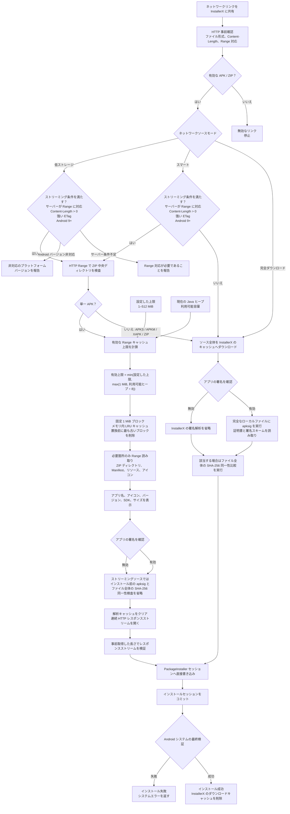

# InstallerX Revived (Community Edition)

[English](README.md) | [简体中文](README_CN.md) | [Español](README_ES.md) | **日本語** | [Deutsch](README_DE.md)

[](https://www.gnu.org/licenses/gpl-3.0)
[](https://github.com/wxxsfxyzm/InstallerX/releases/latest)
[](https://github.com/wxxsfxyzm/InstallerX/releases)
[](https://t.me/installerx_revived)

> モダンで機能的な Android アプリインストーラー。（鳥の中には、檻に入れるべきではないものもいます。その羽はあまりにも鮮やかだからです。）

より良いアプリインストーラーを探していますか？ **InstallerX** を試してみてください。

InstallerX Revived は、モダンな Android パッケージインストーラーであり、元の [InstallerX](https://github.com/iamr0s/InstallerX) プロジェクトをコミュニティで継続しているものです。

制限の多い標準または OEM インストーラーを置き換え、より分かりやすい UI、幅広いパッケージ形式、設定可能なインストールプロファイル、Shizuku / Root / Dhizuku / システムインストーラーモードによる特権ワークフローを提供します。

## ドキュメント

完全なユーザーガイド、インストール手順、高度なオプション、システム統合の注意事項、FAQ は [ドキュメントサイト](https://wxxsfxyzm.github.io/InstallerX-Revived-Website/) で管理されています。

## 主な機能

- **パッケージ形式:** APK、APKS、APKM、XAPK、ZIP 内 APK、一括 APK インストール。
- **インストール方式:** ダイアログ、バックグラウンド通知、自動インストール、権限がある場合のサイレントインストール、対応システムでの Android 16+ Live Activity 進捗表示。
- **認可方式:**
  - **Root:** すべての特権操作を実行できますが、`app_process` のコールドスタートにより遅くなる場合があります。
  - **Shizuku:** 起動方式に応じて shell または root 相当の権限を取得し、通常は直接 Root より高速です。
  - **Dhizuku:** DevicePolicyManager ベースの操作、たとえばデフォルトインストーラーの固定やアプリのインストールを実行できますが、その他の特権操作には制限があります。
  - **None:** 完全にシステムの制限を受けますが、InstallerX がシステムインストーラーとして動作している場合はサイレントインストールできます。
- **プロファイル:** インストール/アンインストール要求の処理方法を定義します。インストールモード、認可方式の上書き、インストーラー/要求元メタデータ、対象ユーザー、DexOpt、自動削除、split 選択、ブラックリスト、署名ポリシーを含みます。
- **システム統合:** ホーム画面のステータスカードからデフォルトインストーラーとして固定でき、[InxLocker](https://github.com/Chimioo/InxLocker) などの LSPosed モジュールと併用できます。上級者はシステムインストーラーの置き換えとしても導入できます。
- **モダン UI:** Material 3 Expressive と Miuix、ダークモード、動的カラー、高度なパレット、システムアイコンパック、カラフルなダイアログ、標準通知、Live Activity、対応 Xiaomi デバイスでの Xiaomi HyperOS 風アイランド通知。
- **安全制御:** パッケージ名/SharedUID ブラックリスト、署名不一致/不明署名ポリシー、権限プレビュー、インストールフラグ、一部のブロックに対する一回限りのスマート提案。

## 対応 Android バージョン

- **完全サポート:** Android SDK 34 - 37.0
- **限定サポート:** Android SDK 26 - 33

限定サポートでは InstallerX が動作する可能性はありますが、Android フレームワーク、OEM、認可方式の制限により一部機能が使えない、または異なる挙動になる場合があります。

## ダウンロード

- **安定版:** https://github.com/wxxsfxyzm/InstallerX-Revived/releases/latest
- **Alpha ビルド:** https://github.com/wxxsfxyzm/InstallerX/releases
- **CI ビルド:** https://github.com/wxxsfxyzm/InstallerX-Revived/actions/workflows/auto-preview-dev.yml
- **Telegram チャンネル:** https://t.me/installerx_revived

不具合を報告する場合は、Stable では既に修正済みの可能性があるため、可能な限り最新の Alpha または CI ビルドで再現してください。

InstallerX は 1 つの APK として公開され、ネットワークアクセスはアプリ内設定で制御されます。有効にすると、APK の直接ダウンロードリンクとオンライン更新機能を利用できます。ネットワークストリーミングインストールでは強い HTTP ETag を必須とし、アプリ情報の取得に上限付き HTTP Range 読み取りを使用します。インストール前のファイル全体の署名スキャンとバイト同一性スキャンを省略し、APK をシステムのインストールセッションへストリーミングし、インストール前に最終レスポンスの長さを検証します。Android はセッションのコミット時にも、整合性、署名、更新互換性の最終検証を行います。ネットワークアクセスを無効にするとネットワークリクエストはブロックされますが、ローカルインストールフローは引き続き動作します。古いアプリ内更新クライアントとの互換性のため、公開 APK のファイル名には引き続き `online` が含まれますが、独立したビルドバリアントを意味するものではありません。

## ネットワークソースの処理フロー

`アプリの署名を確認` は InstallerX によるインストール前の `apksig` 解析を制御します。Android はインストールセッションのコミット時に、整合性、署名、更新互換性の最終検証を必ず行います。



## ビルド

InstallerX Revived は Android Gradle プロジェクトです。

### 前提条件

- **JDK 25** と正しく設定された `JAVA_HOME`。
- 必要な platform と build tools を含む Android SDK / Android Studio。
- snapshot `miuix` 依存関係用の GitHub Packages 認証情報。

### GitHub Packages 認証

GitHub Packages は公開パッケージでも認証が必要です。`read:packages` scope を持つ classic personal access token と GitHub ユーザー名をグローバル Gradle properties に追加してください:

- Linux / macOS: `~/.gradle/gradle.properties`
- Windows: `%USERPROFILE%\.gradle\gradle.properties`

```properties
gpr.user=YOUR_GITHUB_USERNAME
gpr.key=YOUR_PERSONAL_ACCESS_TOKEN
```

これらの認証情報をこのリポジトリにコミットしないでください。

### ビルドコマンド

ローカル debug ビルド:

```bash
./gradlew assembleUnstableDebug
```

別のアプリ ID を使う PR 向けテストビルド:

```bash
./gradlew assemblePreviewDebug -PAPP_ID="com.rosan.installer.x.revived.test"
```

## よくある質問

### 不具合報告や質問はどこで行えばよいですか？

再現可能な不具合や具体的な feature request は [GitHub Issues](https://github.com/wxxsfxyzm/InstallerX-Revived/issues) に投稿してください。良い提案も歓迎します。一般的な質問や互換性に関する相談は [GitHub Discussions](https://github.com/wxxsfxyzm/InstallerX-Revived/discussions) または [Telegram チャンネル](https://t.me/installerx_revived) を利用してください。

Issue を作成する前に、必要なログと再現情報について [CONTRIBUTING.md](../CONTRIBUTING.md) を読んでください。

### InstallerX をデフォルトインストーラーとして固定できない

一部の OEM システムはデフォルトインストーラーを厳しく制御します。ホーム画面のステータスカードからデフォルトインストーラーページを開き、そこで固定を試してください。ROM がまだ阻止する場合は、[InxLocker](https://github.com/Chimioo/InxLocker) などの LSPosed モジュールを使用してください。

### HyperOS でシステムアプリのインストールに有効なインストーラーが必要と表示される

これは OEM のセキュリティ制限です。InstallerX はプロファイルを通じてインストーラーメタデータを宣言でき、HyperOS では互換用のデフォルトインストーラーパッケージとして `com.android.shell` を使用します。このワークフローには Shizuku または Root が必要で、Dhizuku では不十分です。

### 通知インストールの進捗が止まる

一部の ROM はバックグラウンドサービスを厳しく制限します。通知インストールが止まる場合は、InstallerX のバックグラウンド/バッテリー制限を解除してください。InstallerX はインストール完了後すぐにフォアグラウンドサービスを整理します。

### システムインストーラーを置き換えるには？

これは高リスクな上級者向けワークフローです。概要としては、Core Patch で APK を上書きする、対応モジュールをフラッシュする、または該当パッケージを `super` / ROM ビルドに組み込みます。フラッシュや組み込みの前に、ROM のパッケージ名、マウントパス、権限ファイルを確認してください。

詳細はシステム統合ガイドを参照してください: https://wxxsfxyzm.github.io/InstallerX-Revived-Website/guide/system-integration

## ローカライズ

[Weblate](https://hosted.weblate.org/engage/installerx-revived/) で InstallerX Revived の翻訳に協力できます。

[](https://hosted.weblate.org/engage/installerx-revived/)

## ライセンス

Copyright (C) [iamr0s](https://github.com/iamr0s) and [InstallerX Revived Contributors](https://github.com/wxxsfxyzm/InstallerX-Revived/graphs/contributors)

InstallerX Revived は [GNU General Public License v3](http://www.gnu.org/licenses/gpl-3.0) の下で公開されています。

InstallerX Revived を基に作業する場合、使用する特定のソースバージョンのオープンソースライセンス条件に従う必要があります。

## 謝辞

このプロジェクトは、以下のプロジェクトのコードを使用、または実装を参考にしています:

- [iamr0s/InstallerX](https://github.com/iamr0s/InstallerX)
- [tiann/KernelSU](https://github.com/tiann/KernelSU)
- [RikkaApps/Shizuku](https://github.com/RikkaApps/Shizuku)
- [zacharee/InstallWithOptions](https://github.com/zacharee/InstallWithOptions)
- [vvb2060/PackageInstaller](https://github.com/vvb2060/PackageInstaller)
- [compose-miuix-ui/miuix](https://github.com/compose-miuix-ui/miuix)

## Star History

<a href="https://www.star-history.com/?repos=wxxsfxyzm%2FInstallerX-Revived&type=date&legend=top-left">
 <picture>
   <source media="(prefers-color-scheme: dark)" srcset="https://api.star-history.com/chart?repos=wxxsfxyzm/InstallerX-Revived&type=date&theme=dark&legend=top-left&sealed_token=NIZn5WH0-dVDGHKTPTVKAke10T3j7OrdIZ6rTbhT4zwN5AyJhj5aJhc36MEg2ZD5FoBrDoxgF3jzozO8cpBCQoJ65WbUGZZestdrI42Rnv8QVdEvE9Jz-qfghs5RpT5BeRHLuDH2NLyDNypEg34_XaPsTDAkx6DZAl0bUc0tpa0C2xzKBPih_ELq-sP2" />
   <source media="(prefers-color-scheme: light)" srcset="https://api.star-history.com/chart?repos=wxxsfxyzm/InstallerX-Revived&type=date&legend=top-left&sealed_token=NIZn5WH0-dVDGHKTPTVKAke10T3j7OrdIZ6rTbhT4zwN5AyJhj5aJhc36MEg2ZD5FoBrDoxgF3jzozO8cpBCQoJ65WbUGZZestdrI42Rnv8QVdEvE9Jz-qfghs5RpT5BeRHLuDH2NLyDNypEg34_XaPsTDAkx6DZAl0bUc0tpa0C2xzKBPih_ELq-sP2" />
   
 </picture>
</a>
